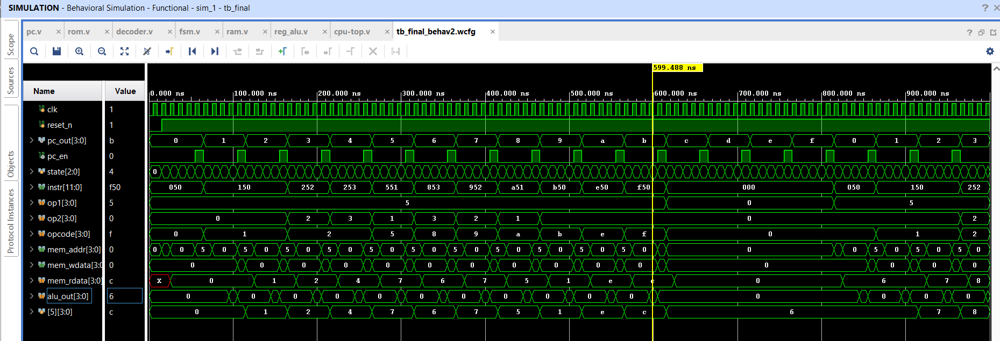

# 🧠 4-bit Multicycle Processor (Verilog RTL)

This repository presents the design, implementation, and verification of a **4-bit multicycle processor** using **Verilog HDL**, demonstrating fundamental CPU microarchitecture concepts including FSM-based control, synchronous memory interaction, and cycle-accurate execution.

The processor follows a **PC-driven instruction execution model** with a **memory-operand architecture**, making it both educational and structurally aligned with real-world processor design principles.

---

## 🔍 Key Features

- 🔄 Multicycle instruction execution (5-cycle pipeline)
- 🧩 FSM-based control unit (cycle-accurate sequencing)
- 🧮 Registered ALU supporting 16 operations
- 💾 16×4 synchronous RAM for data storage
- 📜 ROM-based instruction memory with PC-driven fetch
- 🔌 Modular RTL design (clean datapath–control separation)
- 🧪 Verified via waveform-level simulation
- ⚡ FPGA-ready architecture (Vivado compatible)

---

## 🏗️ Architecture Overview

The processor is divided into two main subsystems:

### 🔹 Instruction Flow
- Program Counter (PC)
- Instruction Memory (ROM)
- Instruction Register (IR)
- Instruction Decoder

### 🔹 Datapath + Control
- FSM Control Unit
- Registered ALU
- Data Memory (RAM)
- ALU Result Register

---

### 📊 Block Diagram

---

### 🔁 Execution Flow

PC → ROM → IR → Decoder → FSM
↓
RAM ↔ ALU → Result Register → RAM

---

## 🧾 Instruction Set Architecture (ISA)

### 📌 Instruction Format

[ opcode (4 bits) | op1 (4 bits) | op2 (4 bits) ]

| Field   | Description |
|--------|------------|
| opcode | ALU operation selector |
| op1    | Memory address (source & destination) |
| op2    | Immediate operand |

---

### ⚙️ Execution Semantics

MEM[op1] ← ALU( MEM[op1], op2 )

Where:

- `A = MEM[op1]`
- `B = op2`

👉 This defines a **memory-operand architecture**, eliminating the need for a register file.

---

## 🧮 ALU Operations (16 Supported)

| Opcode | Operation |
|--------|----------|
| 0000 | PASS A |
| 0001 | A + 1 |
| 0010 | A + B |
| 0011 | A + B + 1 |
| 0100 | A + ~B |
| 0101 | A − B |
| 0110 | A − 1 |
| 0111 | MOV |
| 1000 | OR |
| 1001 | XOR |
| 1010 | AND |
| 1011 | NOT |
| 1100 | NAND |
| 1101 | XNOR |
| 1110 | SHL |
| 1111 | SHR |

---

## 🔄 FSM-Based Control

Instruction execution is governed by a **finite state machine (FSM)**.

### 📌 States

| State | Name | Description |
|------|------|------------|
| 000 | INIT | Reset / initialization |
| 001 | FETCH | Read operand from RAM |
| 010 | WAIT_RD | Wait for memory latency |
| 011 | EXECUTE | Perform ALU operation |
| 100 | WAIT_ALU | Wait for ALU output |
| 101 | STORE | Write result back |

---

### ⏱️ Instruction Timing

Each instruction executes in **5 clock cycles**:

FETCH → WAIT_RD → EXECUTE → WAIT_ALU → STORE

---

## 🧪 Verification

- ✔ All 16 ALU operations verified
- ✔ FSM sequencing validated cycle-by-cycle
- ✔ Memory read/write correctness confirmed
- ✔ Waveform-level simulation ensures timing accuracy

### 📈 Example Waveform

---

## 🧠 Design Highlights

- ✅ **Registered ALU output** ensures timing stability
- ✅ **Synchronous RAM** requires latency-aware FSM
- ✅ **Multicycle execution** reduces hardware complexity
- ✅ **Explicit control signals** prevent race conditions
- ✅ Clean separation of **control vs datapath**

---

## 📁 Repository Structure
4bit-multicycle-processor/
│
├── rtl/ # Verilog RTL modules
├── docs/ # Architecture diagrams
├── waveforms/ # Simulation outputs
└── README.md

---

## 🛠 Tools Used

- Verilog HDL
- Xilinx Vivado (Simulation & Synthesis)
- Behavioral simulation with waveform analysis

---

## ⚠️ Scope & Limitations

- No pipelining or hazard handling
- No branching or control flow instructions
- Limited to 4-bit data width
- Designed for **educational and research demonstration**

---

## 🚀 Future Work

- Add branching and jump instructions
- Extend to 8-bit / 16-bit architecture
- Introduce pipelining
- Integrate register file
- ASIC flow (RTL → GDSII)

---

## 📜 License

This project is released under the **MIT License** and is intended for academic and educational use.

